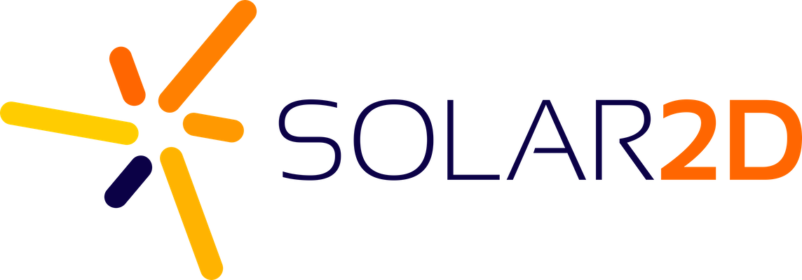

# Solar2D Game Engine
Download the latest build from the [Releases](https://github.com/coronalabs/corona/releases) page and join the community on [Discord](https://discord.gg/Abf5V9G) and the [forums](https://forums.solar2d.com/).

## Rebranded Corona SDK
> Simple to learn and use, completely free and open source 2D game engine.



## Easy-to-learn & powerful
Solar2D is a cross-platform framework which is ideal for rapidly creating apps and games for mobile devices, TV, desktop systems and HTML5. That means you can create your project once and publish it to multiple devices, including Apple iPhone and iPad, Android phones and tablets, Amazon Fire, Mac Desktop, Windows Desktop, Linux, HTML5 and even connected TVs such as Apple TV, Amazon Fire TV, and Android TV.

## Benefits of usage Solar2D
* Free for everybody – Enterprise features for every developer.
* The easiest development tool for 2D games and mobile applications.
* Solar2D allows creating apps easily, up to 10 times faster than other frameworks. 
* Supported by a detailed documentation system. 
* Write the code once, run it many different places – Solar2D supports all major mobile platforms.
* Constantly growing pool of first-party and community provided plugins and ready-to-go app assets.
* A vibrant community of both application and game developers.
* Simulator, which runs the app directly on PC/Mac, simplifies the prototyping process and helps quickly test ideas and concepts.
* A logical and consistent API that covers over 1000 functions and allows to get things up and running very fast.

## Feature highlights

### Simulator and Live Builds
Solar2D speeds up the development process - update your code, save the changes, and instantly see the results in our instant-update Simulator. When you're ready to test on real devices, build and deploy your app just once and then see code/assets, update automatically, all over your local network. Just like magic.

### Lua-based
Lua is an open source scripting language designed to be lightweight, fast, yet also powerful. Lua is currently the leading scripting language in games and has been utilized in Roblox, The Elder Scrolls Online, Don't Starve, World of Warcraft ™, Angry Birds ™, Civilization ™, and [many other popular franchises.](https://en.wikipedia.org/wiki/Category:Lua_(programming_language)-scripted_video_games)

### Use with your favorite text editor
You can use Sublime Text([Editor](https://github.com/coronalabs/CoronaSDK-SublimeText#installation-instructions)), Atom([autocomplete-corona](https://atom.io/packages/autocomplete-corona)), Visual Studio Code([Solar2d-companion](https://marketplace.visualstudio.com/items?itemName=M4adan.solar2d-companion)), ZeroBrane Studio and many others.

### Plugins for all needs
Select from numerous plugins which extend the Solar2D core for features like in-app advertising, analytics, media, and much more. A vast variety of plugins is available via [Solar2D free directory](https://plugins.solar2d.com/) or third party stores, like [Solar2D Marketplace](https://solar2dmarketplace.com/) and [Solar2D Plugins](https://www.solar2dplugins.com/).

### Call any native library
If it’s not already in the core or supported via a plugin, you can call any native (C/C++/Obj-C/Java) library or API using Solar2D Native. It also allows to easily package your code as a plugin.

### Cross-platform
Develop for mobile, desktop, and connected TV devices with just one code base.

## Installation
The easiest and recommended way to get started with Solar2D is to download binary distribution from the [releases](https://github.com/coronalabs/corona/releases) page.


### API documentation and guides
Exhaustive Solar2D API documentation, as well as getting started and more advanced guides are available on [docs.coronalabs.com](https://docs.coronalabs.com).

## Source Code and licensing
Solar2D is licensed under [MIT](LICENSE) open source license.

This license gives you the full rights to customize the engine and distribute built apps on your own terms. 

Note that Solar2D incorporates many libraries, both [third-party](sdk/dmg/Corona3rdPartyLicenses.txt) and made by Solar2D developers. They may have different licenses.


## Contributing

If you are willing to improve Solar2D by contributing code, fork this repository and create a pull request with desired improvements. The project uses [git submodules](https://git-scm.com/book/en/Git-Tools-Submodules), so to clone the whole source code tree run

```sh
git clone --recursive https://github.com/coronalabs/corona.git
```

Due to the open source nature of Solar2D distribution, all contributors would have to sign a simple Contributor License Agreement (CLA) to ensure that their code can be part of Solar2D ecosystem. For more details see [CONTRIBUTING.md](CONTRIBUTING.md).

Entry points for each platform are located in the `platform` directory. Refer to README.md files in its subdirectories.

## Governance and Code of Conduct
Solar2D is maintained by community, with principal developer [shchvova](https://github.com/shchvova). Our mission is to make Solar2D the best game engine ever.

To participate in the Solar2D community or development you must follow the Solar2D Community Code of Conduct (see [CODE_OF_CONDUCT.md](CODE_OF_CONDUCT.md))
